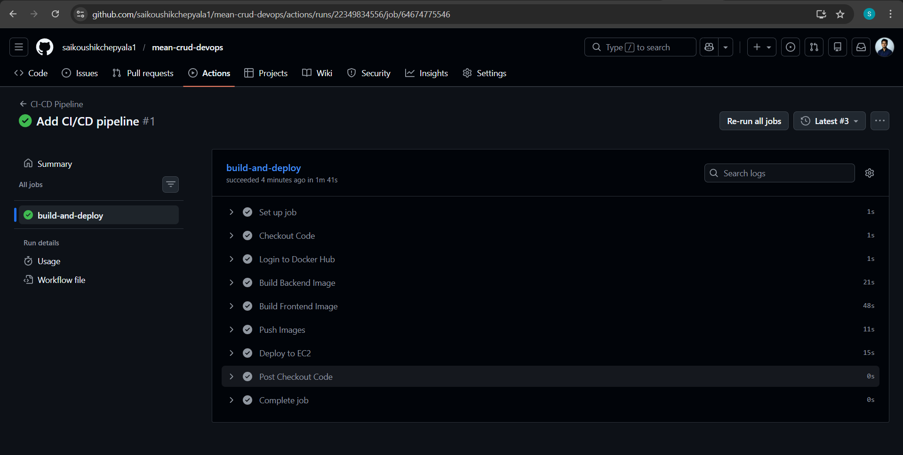
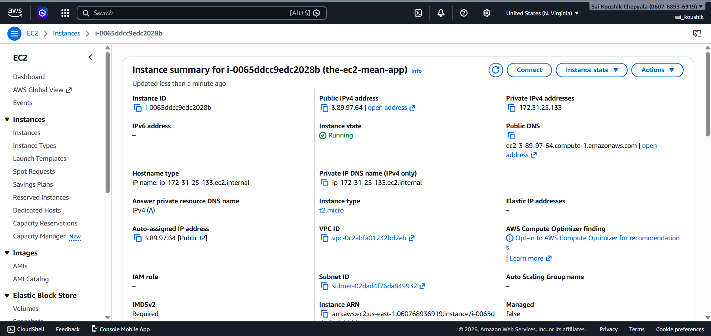
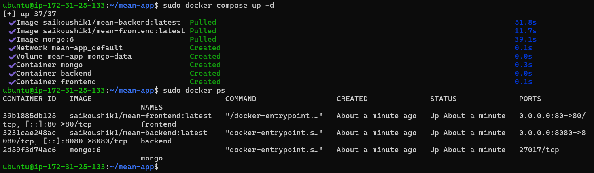
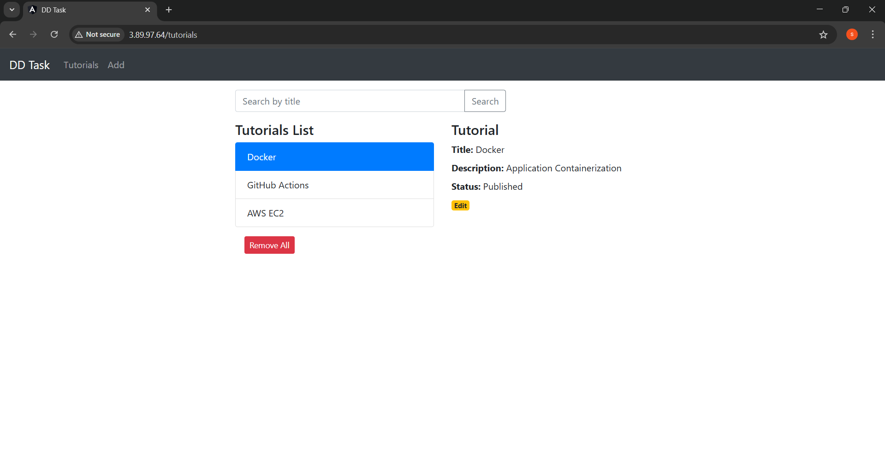
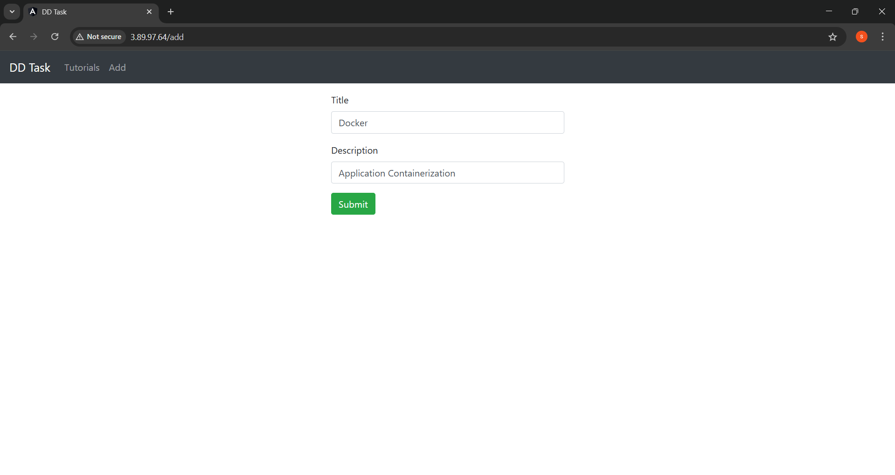
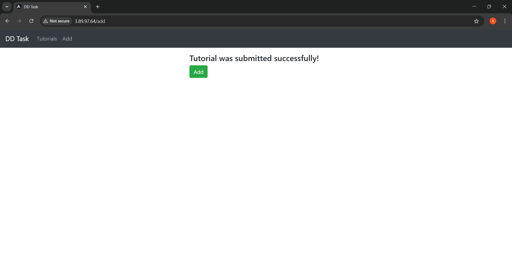

# MEAN Stack CI/CD Deployment using Docker, GitHub Actions & AWS EC2

---

## Project Overview

This project demonstrates the containerization and automated deployment of a full-stack MEAN (MongoDB, Express, Angular, Node.js) application using Docker, Docker Compose, GitHub Actions, and AWS EC2.

The pipeline automatically builds Docker images, pushes them to Docker Hub, and redeploys updated containers on an EC2 Ubuntu server via SSH.

The application is:

* Dockerized (Frontend, Backend, MongoDB)
* Images published to Docker Hub
* Automatically deployed using GitHub Actions
* Hosted on AWS EC2 (Ubuntu)
* Served via Nginx reverse proxy

This repository includes all required:

* Dockerfiles
* docker-compose.yml
* GitHub Actions workflow
* Nginx configuration

---

## Project Structure

```
mean-crud-devops/
│
├── backend/
│   └── Dockerfile
│
├── frontend/
│   ├── Dockerfile
│   └── nginx.conf
│
├── docker-compose.yml
├── .github/workflows/deploy.yml
└── README.md
```

---

# 3. Project Setup

---

## Step 1: Build Docker Images (Local)

Build backend and frontend images:

```
docker build -t mean-crud-devops-backend ./backend
docker build -t mean-crud-devops-frontend ./frontend
```

Verify images:

```
docker images
```

---

## Step 2: Tag and Push Images to Docker Hub

Tag images:

```
docker tag mean-crud-devops-backend <docker-username>/mean-backend:latest
docker tag mean-crud-devops-frontend <docker-username>/mean-frontend:latest
```

Push images:

```
docker push <docker-username>/mean-backend:latest
docker push <docker-username>/mean-frontend:latest
```

### Docker Hub Repository


This confirms successful image publishing.

---

## Step 3: CI/CD Configuration (GitHub Actions)

The workflow file is located at:

```
.github/workflows/deploy.yml
```

On every push to the `main` branch, GitHub Actions will:

1. Checkout source code
2. Build backend image
3. Build frontend image
4. Push images to Docker Hub
5. Connect to EC2 via SSH
6. Pull latest images
7. Restart containers

### CI/CD Pipeline Execution



This screenshot shows successful pipeline execution.

---

## Step 4: AWS EC2 Server Setup

An Ubuntu 22.04 EC2 instance is created with:

* Port 22 (SSH)
* Port 80 (HTTP)

### EC2 Instance



Install Docker on EC2:

```
sudo apt update
sudo apt install docker.io -y
sudo systemctl enable docker
sudo systemctl start docker
```

Install Docker Compose:

```
sudo apt install docker-compose-plugin -y
```

---

## Step 5: Application Deployment using Docker Compose

Deployment is handled using `docker-compose.yml`.

Start containers:

```
docker compose up -d
```

When using CI/CD, the server runs:

```
docker compose pull
docker compose up -d
```

Explanation:

* `docker compose pull` downloads the latest images from Docker Hub.
* `docker compose up -d` recreates containers using updated images.

### Running Containers



This confirms all services are running:

* MongoDB
* Backend
* Frontend (Nginx on port 80)

---

# 6. Nginx Reverse Proxy Configuration

The file `frontend/nginx.conf` configures Nginx.

Key configuration:

```
location /api/ {
    proxy_pass http://backend:8080/api/;
}
```

Purpose:

* Serves Angular frontend on port 80
* Routes `/api` requests to backend container
* Prevents CORS issues
* Enables single-domain access

---

# 7. Live Application

Access the application using:

```
http://<EC2-Public-IP>
```

### Working Application UI



---

# 8. CRUD Operations Demonstration

### Add Tutorial



### Submit Operation



### Update / Delete / Publish


These screenshots confirm full CRUD functionality.

---


